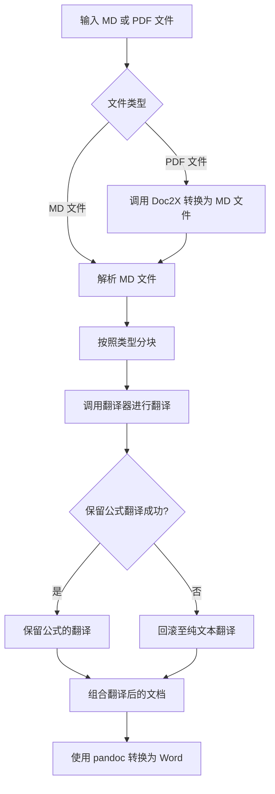

# Trans-PolyDocs

[English](README_EN.md) | 中文

快速将Makdown文档或PDF文档(由Doc2X进行转换)翻译为Markdown/Word，同时保留原有公式/表格/图片格式。

内置支持多种翻译器，支持多线程翻译：
- DeepSeek(默认翻译器)
- OpenAI(支持自定义URL，需以/v1结尾)
- Ollama
- Google翻译(实验性，可能不稳定，由[py-googletrans](https://github.com/ssut/py-googletrans)提供)
- DeepL(官方API)
- DeeLX

| 主界面                                             | LLM设置                                                       | 多种翻译器                                                             |
| ---------------------------------------------------- | -------------------------------------------------------------- | -------------------------------------------------------------------- |
| 拖入或点击导入Markdown/PDF文件，支持自动切换深色模式 | 针对LLM的细化配置，更高自定义空间 | 支持多种翻译器 |
| | |      |


## 使用LLM进行翻译

如您想使用LLM进行翻译，有额外的一些设定以辅助进行翻译。

### 翻译文本提取方式
由于LLM的输出不确定性，内置有三种方式进行翻译文本的提取：`json`、`markdown`和`direct`。预设提示词输出方式需要使用`markdown`方式进行提取。

- `json`方式会从JSON格式中提取键为"translated"的内容
- `markdown`方式会提取被\`\`\`包裹的文本(截取第一个\`\`\`以及最后一个\`\`\`之间的文档)
- `direct`方式则直接使用原始响应文本。

### 提示词

输入提示中可以使用一些变量来填充，您可以在GUI中点击相应按钮复制变量名。支持的变量有：
- `{{text}}` 要翻译的文本(**必填**)
- `{{prev_text}}` 要翻译文本的上文，如没有则为空字符串
- `{{next_text}}` 要翻译的文本的下文，如没有则为空字符串
- `{{dest}}` 翻译目标语言

例如，以下是一个使用变量的输入提示词示范：

```
将以下文本翻译为{{dest}}：
{{text}}
```

> 您无需特殊在提示词中强调保留公式结构，程序将会将公式替换为emoji，再翻译后再做还原。这样可以保证使用任意的翻译器(例如DeepL)都可保留公式翻译。


## 运行GUI

> [!IMPORTANT]
> 如您希望将翻译后的文档以Word形式输出，请安装`pandoc`后运行程序。
>
> Windows:
> [下载安装包安装](https://pandoc.org/installing.html)或在Powershell中输入`winget install --source winget --exact --id JohnMacFarlane.Pandoc`
>
> MacOS:
> 终端中运行`brew install pandoc`
>
> Ubuntu/Debian:
> 终端中运行`sudo apt install pandoc`
>
> Arch/Manjaro:
> 终端中运行`sudo pacman -S pandoc-cli`

### 预编译程序

您可以点击右侧`releases`下载预编译好的程序使用，下载最新版本您对应操作系统的版本，**解压压缩包**后运行使用。

### 调整输出Word样式

调整解压后根目录的`reference.docx`中的样式即可。

### 从源码运行

克隆当前储存库后在储存库路径执行：

```bash
conda create -n translate python=3.12
conda activate translate
pip install uv
uv pip install -r requirements.txt
python app.py
```

## CLI程序

如您想使用CLI程序，克隆当前储存库后，在储存库路径执行复制样例环境变量：

```bash
cp example.env .env
```

随后根据`.env`中的说明内容进行修改，随后配置环境并运行：

```bash
conda create -n translate python=3.12
conda activate translate
pip install uv
uv pip install -r requirements.txt
python Main.py
```

## 自定义翻译器

如您想使用您自己的翻译API，您可以自定义翻译器。一个样例翻译器如下：

```python
def translate(text: str, prev_text: str, next_text: str) -> str:
    try:
        return "This is an example!"
    except Exception as e:
        print(f"Error: {e}")
        return text
```

随后在您自己的程序中导入`MD_Translate.py`进行使用：

```python
# 您定义的translate方程
from MD_Translate import Process_MD
file_path = "path" # MD文件的路径
threads = 10 # 翻译的线程数
Process_MD(md_file=file_path, translate=translator, thread=threads)
```
## 运作流程



## 打包

使用pyinstaller进行打包。使用`pip install pyinstaller`进行安装。运行以下指令：

```bash
pyinstaller -w --onefile -i icon.png app.py
```

并复制项目中的`reference.docx`以及`example.env`到打包出的二进制文件同一目录中即可。
