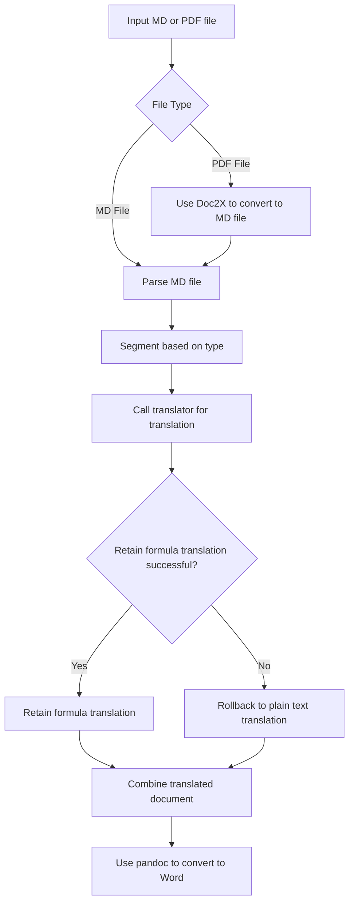

**# Trans-PolyDocs**

Quickly translate Markdown documents or PDF documents (converted by Doc2X) into Markdown/Word while retaining the original format of formulas/tables/images.

Supports multiple translators and multi-threaded translation:
- DeepSeek (default translator)
- OpenAI (supports custom URL, must end with /v1)
- Ollama
- Google Translate (experimental, may be unstable, provided by [py-googletrans](https://github.com/ssut/py-googletrans))
- DeepL (official API)
- DeeLX

| Main Interface | LLM Settings | Multiple Translators |
| ---------------------------------------------------- | -------------------------------------------------------------- | -------------------------------------------------------------------- |
| Drag or click to import Markdown/PDF files, supports automatic dark mode switching | Detailed configuration for LLM, offering more customization | Supports multiple translators |
| | |  |

**## Translating using LLM**

If you wish to use LLM for translation, there are additional settings to aid in the translation process.

**### Text Extraction Method for Translation**

Due to the uncertainty of LLM output, three methods are built-in for extracting translated text: `json`, `markdown`, and `direct`. The preset prompt output requires using the `markdown` method for extraction.

- `json` method extracts content with the key "translated" from JSON format.
- `markdown` method extracts text enclosed in \`\`\` (snips documents between the first and last \`\`\`).
- `direct` method uses the raw response text directly.

**### Prompts**

You can use some variables in the input prompt to fill in. In the GUI, you can click the corresponding button to copy the variable name. Supported variables include:
- `{{text}}` Text to be translated (**REQUIRED**)
- `{{prev_text}}` Previous text context, if none, then an empty string
- `{{next_text}}` Next text context, if none, then an empty string
- `{{dest}}` Target language for translation

For example, here is a sample input prompt using variables:

```
Translate the following text to {{dest}}:
{{text}}
```

> You do not need to emphasize retaining formula structure in the prompt; the program will replace formulas with emoji and restore them post-translation. This ensures that any translator (such as DeepL) can retain formula translation.

**## Running the GUI**

> [!IMPORTANT]
> If you wish to output the translated document as a Word file, please install `pandoc` before running the program.
>
> Windows:
>
> [Download installer](https://pandoc.org/installing.html) or enter `winget install --source winget --exact --id JohnMacFarlane.Pandoc` in Powershell
>
> MacOS: Run `brew install pandoc` in Terminal
>
> Ubuntu/Debian: Run `sudo apt install pandoc` in Terminal
>
> Arch/Manjaro: Run `sudo pacman -S pandoc-cli` in Terminal

**### Precompiled Program**

You can click on `releases` on the right to download the precompiled program, download the version corresponding to your operating system, **unzip** the package, and run the program.

**### Adjusting Output Word Styles**

Adjust the styles in the `reference.docx` located at the root directory after extraction.

**### Running from Source**

After cloning the current repository, execute it from the repository path:

```bash
conda create -n translate python=3.12
conda activate translate
pip install uv
uv pip install -r requirements.txt
python app.py
```

**## CLI Program**

If you wish to use the CLI program, after cloning the current repository, execute the following in the repository path to copy sample environment variables:

```bash
cp example.env .env
```

Then modify it according to the instructions in `.env`, configure the environment, and run:

```bash
conda create -n translate python=3.12
conda activate translate
pip install uv
uv pip install -r requirements.txt
python Main.py
```

**## Custom Translator**

If you want to use your own translation API, you can customize a translator. A sample translator is as follows:

```python
def translate(text: str, prev_text: str, next_text: str) -> str:
    try:
        return "This is an example!"
    except Exception as e:
        print(f"Error: {e}")
        return text
```

Then import `MD_Translate.py` in your program for use:

```python
# Your defined translate function
from MD_Translate import Process_MD
file_path = "path"  # Path to the MD file
threads = 10  # Number of translation threads
Process_MD(md_file=file_path, translate=translator, thread=threads)
```



**## Packaging**

Use pyinstaller to package. Install with `pip install pyinstaller`. Run the following command:

```bash
pyinstaller -w --onefile -i icon.png app.py
```

And copy the `reference.docx` and `example.env` from the project to the same directory as the generated binary file.